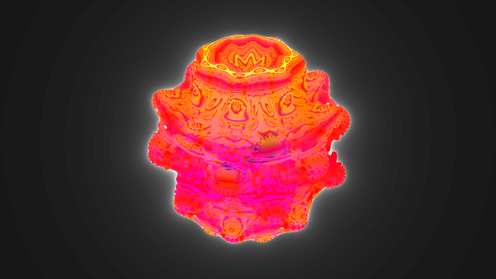

# Haskell OpenGL Mandelbulb

## About

This is a simple Haskell + GLSL program that renders the Mandelbulb 3D fractal in realtime. The Haskell OpenGL bindings are used, along with GLFW for window creation.



The Mandelbulb itself is rendered entirely in a fragment shader which takes the screen position (and time for a rotation effect) and uses ray-marching, a rendering algorithm similar to ray-tracing, to project rays of light iteratively further from the camera in the direction of the pixel's projection on the back of a frustrum, until they collide with the object.

Ray-marching is used to render signed distance functions (SDFs), functions of 3 variables which describe the distance to the object (negative sign means inside the object). Thus, the above render is the 0-isosurface of a function from R^3 -> R. For details on the algorithm for deriving the SDF of a Mandelbulb, see [Inigo Quilez's site](https://www.iquilezles.org/www/articles/mandelbulb/mandelbulb.htm), and for information on SDFs and how they relate to ray-marching, see [Jamie Wong's site](http://jamie-wong.com/2016/07/15/ray-marching-signed-distance-functions/).

## How to run
Install `ghc`, a Haskell compiler, and `stack`, the package manager for Haskell. Then, install dependencies as shown below.
```
$ stack install OpenGL GLUT GLFW-b vector
```
And run the `mandelbulb.hs` file.
```
$ stack runhaskell mandelbulb.hs
```
